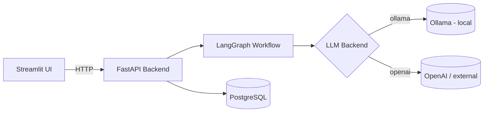

# Automating HR with Agents

MVP for automating the initial screenings of HR processes (mostly outside white collar jobs) with stateful agents and human-in the loop for the important stuff. Designed to run on a local opensource stack for sensitive PII handling and avoiding lock-in, but can fall back to external LLM providers (OpenAI, Anthropic, DeepSeek…) when there's no on-prem GPU.


## Architecture



Ollama runs on the host (outside Docker Compose) and is reached from the containers via `host.docker.internal`. A single env switch (`LLM_BACKEND=ollama|openai`) swaps providers — no code changes needed.

## Stack

Selected following the principle of less complexity first (more on it on [docs/design-tradeoffs.md](docs/design-tradeoffs.md)):

- **Backend**: FastAPI + LangGraph for stateful, explicit conversation flows
- **UI**: Streamlit chat interface
- **Storage**: PostgreSQL
- **LLM**: Ollama (local) or any OpenAI-compatible provider
- **MLOps**: pipecat, langchain, pydantic-settings, loguru

## Structure

```text
.
├── production/   # API + UI, ready to deploy
│   ├── api/
│   └── ui/
├── src/          # Modular source code (PyPI-ready)
└── docs/         # Process design, tradeoffs, next steps
```

## Install

### Local

```bash
brew install pyenv          # mac — on linux: sudo apt install pyenv
pyenv install 3.13.0
pyenv virtualenv 3.13.0 hr
pyenv activate hr
pyenv local hr
pip install -r requirements.txt
```

### Docker

```bash
docker compose up --build
```

> Ollama must be running on the host before bringing the stack up. See `docs/` for the launch script that handles this.

## Usage

```bash
# Start the backend
uvicorn production.api.main:app --reload

# In another terminal, start the UI
streamlit run production/ui/app.py
```

## License & Authors

This project has been singlehandedly made by Walter Troiani, but special thanks to all the contributors of the open source packages used throughout the project.

Licensed under Apache 2.0.
